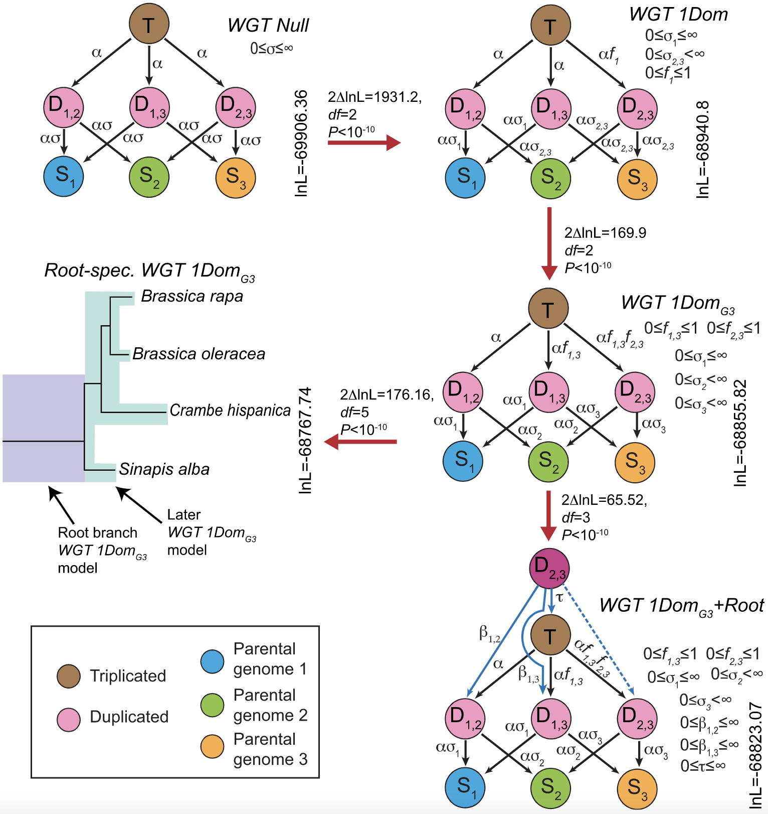

[](http://www.gnu.org/licenses/gpl-3.0)

# Modeling ancient whole-genome triplication with POInT

[POInT](https://github.com/gconant0/POInT) stands for the **P**olyploid **O**rthology **In**ference **T**ool. Using POInT, we modeled the whole-genome triplication (WGT) events shared by the members of the tribe Brassiceae ([Hao et al., 2021](https://genome.cshlp.org/content/31/5/799)). Here we will show the steps for different WGT model comparisons.

## Installation

The latest version of the POInT software is available on [GitHub](https://github.com/gconant0/POInT) or on the [lab website](http://conantlab.org/POInT/POInT.html). For detailed installation guide, please go to the software [installation page](http://conantlab.org/POInT/INSTALL). To download and compile the software:
```
wget http://conantlab.org/POInT/POInT.tar
tar xvf POInT.tar.gz
cd POInT
# To compile the OpenMP parallel version
./configure.pl -omp
make
```
Create a symbolic link in the home directory bin:
```
cd ~/bin
ln -s /where_POInT_was_downloaded/POInT/POInT
```
Test to see if the software was successfully compiled:
```
cd
POInT
```
You should see the following:
```
	Using 16 threads for this run
Usage: search_WGX_assigns -g:<genome file> -g:<genome file> -o:<ortholog file> -m:<Model file>  (-r:<Root model file>) (-t:treefile) (-p:<posteriortrackprobs file>) (-c:<conditional probabilities file> (-no_opt) (-s:<start>:<end>) (-zerolengthfixed) (-x:#TreestoSave)
```

## Input Data

The input files for this case study are available on [Figshare](https://doi.org/10.6084/m9.figshare.12277832)


## WGT models
From Figure 2 in [Hao et al. (2021)](https://genome.cshlp.org/content/31/5/799).



1. WGT Null model scenario: Null model with no biased fractionation. 
```
search_WGX_assigns -d:3 -g:Brassica_rapa_POInT_geneorders.txt -g:Brassica_oleracea_POInT_geneorders.txt -g:Sinapis_alba_POInT_geneorders.txt -g:Crambe_hispanica_v3_POInT_geneorders.txt -o:FourSpp_M2Opt3.txt -m:WGT_Null_model.txt -t: BrBoSaCh_WGT_3rate_G1Dom_M2Opt3_Top3.tre
```
2. WGT 1Dom model scenario: MF1 and MF2 subgenomes are more fractionated than the LF subgenome. But the fractionation rates for MF1 and MF2 are the same.
```
search_WGX_assigns -d:3 -g:Brassica_rapa_POInT_geneorders.txt -g:Brassica_oleracea_POInT_geneorders.txt -g:Sinapis_alba_POInT_geneorders.txt -g:Crambe_hispanica_v3_POInT_geneorders.txt -o:FourSpp_M2Opt3.txt -m:WGT_2rate_G1Dom_model.txt -t: BrBoSaCh_WGT_3rate_G1Dom_M2Opt3_Top3.tre
```
3. WGT 1DomG3 model scenario: MF2 is more fractionated than MF1, and MF1 is more fractionated than LF.
```
search_WGX_assigns -d:3 -g:Brassica_rapa_POInT_geneorders.txt -g:Brassica_oleracea_POInT_geneorders.txt -g:Sinapis_alba_POInT_geneorders.txt -g:Crambe_hispanica_v3_POInT_geneorders.txt -o:FourSpp_M2Opt3.txt -m:WGT_3rate_G1Dom_model.txt -t: BrBoSaCh_WGT_3rate_G1Dom_M2Opt3_Top3.tre
```
4. Root-spec. WGT 1DomG3 is similar to model 3, but with two sets of parameters, one for the root branch and the other for the remainder of the branches in the phylogenetic tree, modeling the scenario of shifted fractionation rates from root branch to later branches.
```
search_WGX_assigns -d:3 -g:Brassica_rapa_POInT_geneorders.txt -g:Brassica_oleracea_POInT_geneorders.txt -g:Sinapis_alba_POInT_geneorders.txt -g:Crambe_hispanica_v3_POInT_geneorders.txt -o:FourSpp_M2Opt3.txt -m:WGT_3rate_G1Dom_brnspec_model.txt -t: BrBoSaCh_WGT_3rate_G1Dom_M2Opt3_Top3.tre
```
5. WGT 1DomG3 + Root is modeling the two-step hexaploidy scenario ([Cheng et al., 2012](https://journals.plos.org/plosone/article?id=10.1371/journal.pone.0036442); [Tang et al., 2012](https://academic.oup.com/genetics/article/190/4/1563/6064110)), in which the MF1 and MF2 merged first following an initial round of gene loss, and the LF subgenome joined later, with subsequent more gene loss. 
```
search_WGX_assigns -d:3 -g:Brassica_rapa_POInT_geneorders.txt -g:Brassica_oleracea_POInT_geneorders.txt -g:Sinapis_alba_POInT_geneorders.txt -g:Crambe_hispanica_v3_POInT_geneorders.txt -o:FourSpp_M2Opt3.txt -m: WGT_3rate_G1Dom_model.txt -r:WGT_RootModel.txt -t: BrBoSaCh_WGT_3rate_G1Dom_M2Opt3_Top3.tre
```

## License
POInT is a free and open source software, licensed under [GPLv3](https://github.com/github/choosealicense.com/blob/gh-pages/_licenses/gpl-3.0.txt).
